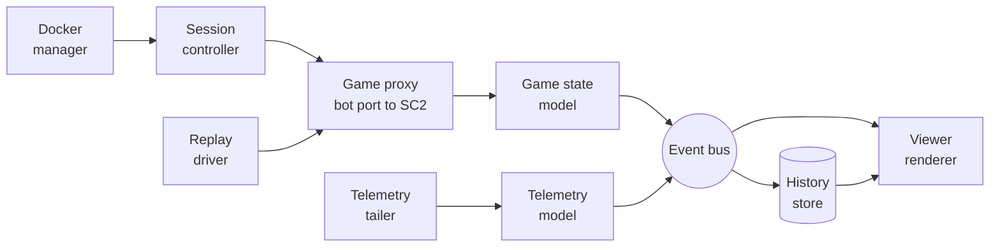
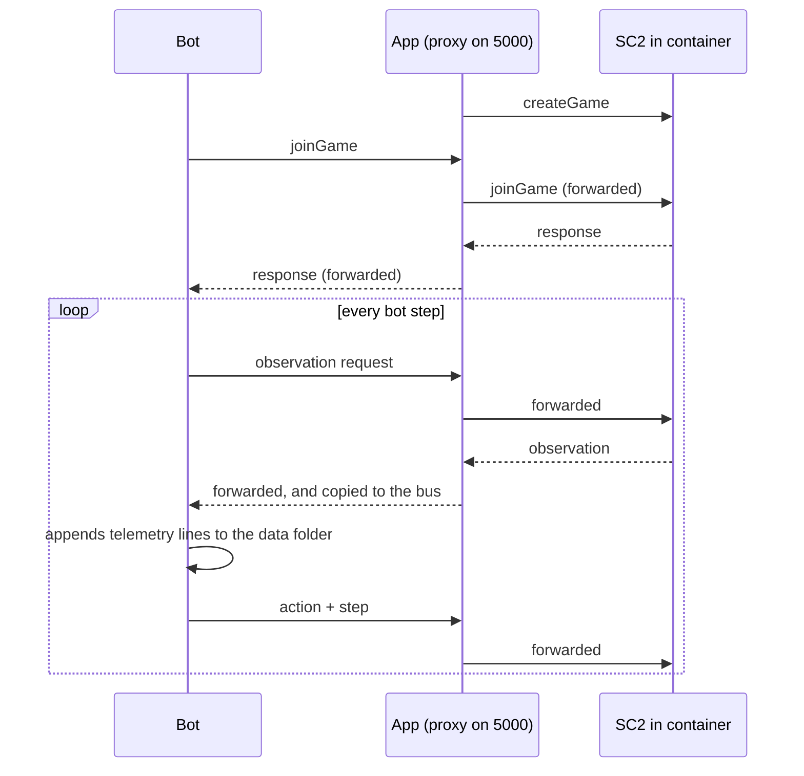
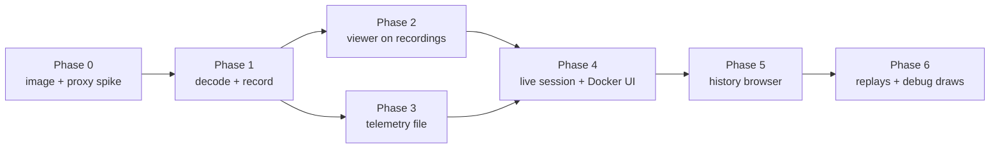

# SC2 Bot Dev Tool — Implementation Plan

2026-09-19 · @Someone

## 1. Scope, confirmed decisions, verified facts

This plan specifies a standalone Node.js desktop tool that runs a headless SC2 client in Docker, visualizes live bot games and replays, ingests bot telemetry over a separate channel, and stores every game for later review. It is written for a Claude Sonnet + human implementation session; it contains no code and no file contents.

**Decisions confirmed with Alex (2026-09-19)**

- Name: **Spectator** (decided; see §2 for the alternatives that were considered).
- Own container, no third-party proxy: the app ships its own Dockerfile that packages Blizzard's headless Linux SC2 client and maps, exposing only the game's native API port. The app itself is the man-in-the-middle between bot and game (§4). This replaces the reuse of `stephanzlatarev/starcraft` and removes the unknown proxy from the design.
- Game creation: the user selects the mode in the app before starting a session. Mode A: the app sends `createGame` and the bot only `joinGame`s. Mode B: the bot creates the game (python-sc2 default) and the app only forwards. No traffic-based detection.
- Telemetry contract: an NDJSON file the bot writes to a data folder (§3.4). Locally the app tails the file; for AI Arena matches the same file is imported next to the replay. A socket transport is optional and later.
- History: store full per-step game state for every game (every observation the bot received), not just replays or samples.
- Replay viewing is deferred to the last phase; when it comes, its main use is AI Arena replays plus the bot's telemetry file from that match.
- Native SC2 debug draws: rendered as a low-priority late-phase feature; telemetry is the primary path for bot reasoning.
- Zero pause coordination: the app never pauses, steps, or delays the bot's traffic. A halted bot process (breakpoint) freezes the lockstep game by itself; the app only displays the frozen state.
- The app has no knowledge of any bot architecture, race, layer names, or module names. Nothing in the app or its data model may encode these.

**What was learned from the vscode-starcraft repository (cloned and read 2026-09-19) and what this design takes from it.** The extension is prior art, not a dependency.

| Topic | What the extension does | What this app does instead |
| --- | --- | --- |
| Container | Pulls `stephanzlatarev/starcraft:latest` (linux/amd64), whose opaque in-image proxy exposes a bot port and a watch port | Builds its own image from a Dockerfile in the app repo: a slim Linux base, Blizzard's headless SC2 Linux package at a pinned version, the game's own API port exposed. No proxy in the image. |
| Watch port | A WebSocket at `/sc2api` on 5001 mirroring bot traffic, plus 1-byte control codes and a second-client request path whose rules are unknown | Not needed. The app listens on the bot port itself and forwards every frame to SC2 over one WebSocket, so it sees requests and responses with exact pairing and can issue its own read-only requests in the gaps. |
| Wire format | One whole protobuf `Request` or `Response` per WebSocket binary frame; `Response.status` marks launched / in-game / ended | Same, because this is the game's native protocol: one frame per message, decoded with the `s2clientprotocol` schema. |
| Game version | Whatever the image ships | Pinned in the Dockerfile to the version AI Arena runs, so ladder replays load and the bot behaves as it will on the ladder. Version is a build argument, not a guess. |
| Replays | Viewer copies the file into `/replays`, then `replayInfo`, `startReplay`, and a `step`/`observation` loop | Same mechanism when replays arrive (last phase), driven by the app as the only client. |
| Maps | Mounted from a user folder into `/StarCraftII/Maps`; user supplies AI Arena map packs | Same: app-managed maps folder mounted into the container; app validates map presence before creating a game. |
| Host paths for `-v` | Deletes the colon from VS Code's `/c:/Users/...` form | Whatever host-path form Docker Desktop on Windows accepts must be tested in Phase 0 with a path containing a drive letter and spaces; not copied blindly. |
| Native debug draws | Rendered from the bot's `debug` requests; JSON inside debug text is treated as custom shapes | Same source of shapes, mapped into the telemetry overlay renderer (§3.6), late phase. |

Building the image is a Phase 0 task with its own verification items (§7.1): the download URL and licence terms for Blizzard's headless Linux package, the version AI Arena currently runs, the exact launch flags for headless mode, and whether the client hosts consecutive games without a restart.

## 2. Name proposals

Decided: **Spectator**. It says exactly what the tool is (it watches, never plays), is race- and architecture-neutral, and matches the SC2 term for a non-participant viewer. The alternatives below are kept for the record.

| Name | Rationale | Risk |
| --- | --- | --- |
| Spectator | Passive observer of bot games; familiar SC2 term; short | Generic word, weak for searching; suffix like `sc2-spectator` for the repo |
| Scrimlab | Practice games ("scrims") plus a lab for inspecting them; covers live + history + comparison | Slightly cute; "scrim" is more common in team games than in SC2 |
| Loopglass | "Game loop" + magnifying glass; hints at per-step inspection and time scrubbing | Invented word, needs explaining once |
| Sidecar | The app runs beside the bot and the game without touching either; also the telemetry emitter is literally a sidecar | Overloaded term in Kubernetes contexts |
| Overwatch | SC2 flavour without naming a race | Collides with a well-known Blizzard game; avoid |

Naming rule for the codebase: the product name is the only SC2-flavoured word. Internal modules use plain nouns (`docker`, `watch`, `replay`, `telemetry`, `history`, `viewer`).

## 3. Telemetry interface design

The contract is a small vocabulary of *renderable things*, not a taxonomy of bot concepts. The bot names its own channels; the app only knows how to draw five kinds of data and builds its UI from whatever channel names arrive. Adding a new layer, renaming a module, or switching race changes the strings the bot sends and nothing in the app.

### 3.1 What a spatial bot debugger actually needs (derived from use cases)

| Use case the developer has | Data shape it needs | Kind |
| --- | --- | --- |
| "Where does the bot think the enemy army is?", influence and threat maps, planned expansion sites, rally points, pathing | Geometry in map coordinates that stays on screen until the bot updates it | `overlay` |
| "How confident is it, how does its threat score move, when did its army-value estimate diverge from reality?" | Numbers per game loop, plotted and scrubbable | `series` |
| "Why did it decide X at loop 4120?" | Discrete, timestamped, filterable log entries with structured payload | `event` |
| "What is its whole current plan / belief structure right now?" | An arbitrary JSON document valid at a point in time, diffable against the previous one | `snapshot` |
| "Which task is this unit assigned, what priority, what does the bot know about that enemy unit?" | Key-value data keyed by the game's own unit tag, joined with observed units | `entity` |

These five are justified by joining requirements, not intuition: overlays join on map coordinates, series and events join on the time axis, snapshots join on nothing (they are inspected), and entity data joins on unit tags from the observation. Anything a bot reports fits one of these joins or is not visualizable spatially at all. No sixth kind is planned; if one is needed later it is an additive schema version.

### 3.2 Message envelope

Every message is one JSON object with these fields. Field names are the contract; the Python emitter is a convenience wrapper around them.

| Field | Required | Meaning |
| --- | --- | --- |
| `v` | yes | Schema version integer, starts at 1 |
| `kind` | yes | `hello`, `overlay`, `series`, `event`, `snapshot`, `entity`, `end` |
| `loop` | all but `hello`/`end` | Game loop at which the bot observed the state this message describes. The only time axis. Never wall-clock. |
| `ch` | all but `hello`/`end` | Channel: free-form string, `/`-separated for hierarchy (e.g. `enemy/estimate/army`). The app builds a tree from it. |
| `seq` | no | Monotonic counter per file, for ordering within a loop |
| `style` | no | Rendering hints: colour, opacity, line width, label, z-order. Defaults exist for every kind. |
| `data` | yes | Kind-specific payload (below) |

`hello` carries: emitter version, a free-form `name` (whatever the bot calls itself), optional `meta` object (git hash, config, anything), and optional `channels` pre-declarations with display hints (units, expected range, default visibility). Pre-declaration is optional; undeclared channels appear on first use. `end` marks a clean shutdown; absence of `end` is not an error.

### 3.3 Kind payloads and retention semantics

| Kind | `data` payload | Retention rule (what the viewer shows at loop L) |
| --- | --- | --- |
| `overlay` | List of shapes: `point`, `circle`, `line`, `polyline`, `polygon`, `rect`, `text` (at a position), `grid` (cell size + origin + values, for heatmaps and influence maps). Coordinates are SC2 map coordinates, same frame as `rawData.units`. | Replaces the channel's previous content. Valid until the channel is next written or until `ttl` loops elapse if `ttl` is set. This makes "draw once per decision" cheap and "draw every step" possible. |
| `series` | One or more `{name, value}` pairs, or a single number when `ch` names the series itself | Append-only points on the time axis |
| `event` | `msg` string plus optional `data` object and `level` (`debug`/`info`/`warn`/`error`); optional `pos` to pin it on the map | Append-only; shown in the log, as ticks on the timeline, and as a map marker if positioned |
| `snapshot` | Any JSON value | Replaces the channel's previous snapshot; the viewer can diff consecutive snapshots |
| `entity` | `tag` (the game's unit tag) plus any JSON object | Replaces previous data for `(ch, tag)`; dropped when the unit disappears from observation unless the channel is declared sticky |

Grids get a compact encoding option (`enc: "b64f32"` or `"b64u8"` with scale/offset) because a 200×200 influence map as a JSON array is 40k numbers per update; this is the one place plain JSON is not good enough.

### 3.4 Transport

**Chosen: the bot appends newline-delimited JSON to a file in a data folder; the app tails that file locally and imports it for matches played elsewhere.** One file per game, one message per line, the same envelope as §3.2.

Why a file rather than a socket:

- One contract covers both the local live case and AI Arena ladder matches: on the ladder there is no app to connect to, but the bot can write into its data folder and the file comes back with the replay (verify what AI Arena returns and its size limit; §7.1). Loop numbers align the file to the replay without any other link.
- The bot needs nothing but the standard library and a writable directory. No port, no reconnect logic, no risk of the emitter ever blocking on a peer.
- Telemetry survives the app not running, crashing, or being started late; the app simply reads from the beginning of the file.
- The file is its own archive format: history import and live ingest are the same code path.
- A socket (NDJSON over TCP on a local port) remains a possible second transport for remote setups; it is not in v1.

File layout and tailing:

- The bot writes `<data dir>/telemetry/<start timestamp>-<bot-chosen name>.ndjson`, opened in append mode, one line per message, flushed at the end of each loop. Grids use the compact encoding of §3.3.
- The first line is `hello`; the emitter writes it on open. A game boundary is a new file, never a marker inside one.
- The app watches a configured telemetry folder (defaults to the folder mounted into the container for the bot's data) by polling every \~150 ms plus `fs.watch` where it fires; it tracks the byte offset per file and parses only complete lines. Windows file-watch latency is therefore bounded by the poll interval.
- The emitter never blocks the bot beyond a local disk write, never raises, and never grows unbounded: a bounded in-memory buffer is written by a background thread; on write failure it drops and records one `event` noting the dropped count.
- The emitter emits `overlay`/`snapshot` only when content changed (the helper compares) and rounds floats to limit volume.

Breakpoint behaviour follows for free: a halted bot stops writing; the file stops growing; the app shows the last loop. Nothing to design.

### 3.5 Correlating a telemetry stream with a game

The telemetry file carries no game id (the bot need not know one). Locally, a new file appearing while a game is live attaches to that game; one appearing before a game starts attaches to the next game whose first observation follows the file's creation. Two files active at once (two bots) each become their own stream, named from `hello.name`. On import, the user pairs a file with a replay explicitly, and the app checks that the file's loop range fits the replay's duration. Mis-attachment is recoverable in the history UI by re-linking a stream to a game. This is deliberately loose because the alternative (the app tells the bot a game id) is exactly the coordination the brief forbids.

### 3.6 Rendering arbitrary telemetry without foreknowledge

- Channel tree panel: built dynamically from `ch` strings; each node has a visibility toggle and inherits the kind's default renderer. Nothing is hard-coded.
- `overlay`: drawn on the map view in the same coordinate transform as units; `style` controls colour/width; a legend is generated from channel names.
- `series`: a chart panel where the user multi-selects channels; the x-axis is game loop and is locked to the map's timeline cursor, so scrubbing moves both.
- `event`: a filterable log (by channel, level, text); ticks on the timeline; click to jump the cursor; positioned events show a marker on the map.
- `snapshot`: a collapsible JSON tree inspector with "diff against previous" and "diff against loop N".
- `entity`: shown in the unit inspector when a unit is selected, and optionally as a short label rendered next to the unit on the map (the channel's `style.label` picks which field).
- Native SC2 debug draws (late phase) are converted into synthetic `overlay` messages on a reserved channel prefix such as `_game/debug`, so they share the toggle tree and renderer.

The viewer's state at loop L is computed by replaying retention rules over stored messages up to L, which is also what makes the history browser identical to the live view.

## 4. Component architecture

One Node.js backend process owns Docker, the bot-facing proxy, the telemetry tailer, and the store; one renderer process draws. Every data path goes through a single in-process event bus keyed by `(sessionId, loop)`, so live view, history view, and persistence consume the same stream.

Reading: the game proxy and the telemetry tailer are independent inputs; the store and the viewer are independent outputs; the session controller decides when a game starts and ends.

| Component | Responsibility | Must not do |
| --- | --- | --- |
| Docker manager | Detect Docker client/daemon; build the app's image from its Dockerfile if missing (or pull a published build of it); run the container with an app-owned name, the game's API port published to localhost only, and volumes for maps and the bot data folder; probe until the game's WebSocket accepts; stop/restart; stream container logs to a diagnostics panel | Assume the container survives across games without verification (Phase 0 item) |
| Game proxy | Listen on the bot port (default 5000). Accept one bot connection, open one WebSocket to the game in the container, forward every frame both ways unchanged and in order. Decode each frame as `Request` or `Response` and pair them; forward `gameInfo`, `data`, `observation`, `action`, `debug`, `step`, `createGame`, `joinGame`, and status changes to the bus. When asked by the session controller, send its own read-only requests to the game only between a bot response and the bot's next request, and never surface those to the bot | Delay, reorder, drop, or alter bot traffic; send `step` or `action` while a bot is connected |
| Session controller | User-selected mode. State machine: `containerDown → clientReady → gameCreated → inGame → ended`. Mode A: sends `createGame` (map, opponent, difficulty, race for the built-in AI only) then waits for the bot's `joinGame`. Mode B: waits for the bot's own `createGame` and forwards it. On `ended`, requests `saveReplay` through the proxy, closes the session, and in Mode A immediately creates the next game so the bot can be relaunched without touching the app | Restart anything on behalf of the bot |
| Game state model | Turns decoded protobuf into a per-loop normalized state: map metadata and grids from `gameInfo`, name lookups from `data`, units/effects/upgrades/resources/alerts from `observation`, and the bot's issued commands from `Request.action`. Keeps last state and emits deltas | Interpret what the bot is thinking; that is telemetry's job |
| Replay driver (last phase) | Copy a `.SC2Replay` into the container, `replayInfo`, map and build check, `startReplay` with raw data and fog off, then a paced `step`/`observation` loop with play/pause/speed/seek controls, as the game's only client. Pausing here is fine: no bot is involved | Run while a live bot session is active on the same container |
| Telemetry tailer | Watch the telemetry folder; per-file byte offset; parse complete NDJSON lines; schema validation with clear per-line rejection (bad lines are logged, never fatal); attach each file to a session per §3.5; also used verbatim for import of a file next to a replay | Require anything from the bot beyond a writable folder |
| Telemetry model | Applies retention rules (§3.3) to produce "telemetry state at loop L"; maintains the channel tree | Know any channel names in advance |
| History store | Persists every bus event; offers a query API: list games, load game metadata, load state at loop L, range queries on series and events | Hold the live session in memory only |
| Viewer | Map renderer (pan, zoom, click-to-move, unit picking, paths, overlays), minimap, timeline scrubber shared by game state and telemetry, channel tree, series chart, event log, snapshot inspector, unit inspector, game list/browser, mode selector, Docker controls and diagnostics | Talk to Docker, sockets, or the filesystem directly |

### 4.1 Live game, Mode A, one loop

Reading: the app adds nothing of its own inside the loop; every bot frame is forwarded as-is. If the bot halts at a breakpoint, no frames flow and the file stops growing, so the viewer shows the last completed loop with a "stream idle for N s" indicator.

### 4.2 Frozen-stream display

The viewer treats silence as normal. It shows the time since the last game frame and since the last telemetry line, greys the play state indicator, and resumes on the next frame. There is no timeout that changes state; only the game's `status` transitions or a bot socket close end a session.

## 5. Stack specifics

Recommended: Electron shell, TypeScript everywhere, PixiJS for the map, React for panels, protobufjs for decoding, better-sqlite3 for storage. Each choice was weighed against alternatives below; the implementer should treat these as decided unless Phase 0 falsifies a premise.

| Concern | Choice | Alternatives considered and why rejected |
| --- | --- | --- |
| App shell | **Electron** (Node main process = the backend; renderer = the viewer) | *Node server + browser tab*: workable, but drag-and-drop yields file contents instead of paths, no native window/tray, and a "go open localhost" step is the workflow friction being removed. *Tauri*: Rust core conflicts with the decided Node backend; would need a Node sidecar. *Terminal UI*: cannot draw the map. |
| Language | **TypeScript** across main, preload, renderer, and shared schema types | Plain JS loses the schema typing that keeps telemetry and protobuf handling honest for an AI implementer. |
| Map rendering | **PixiJS v8** (WebGL, falls back to WebGPU/Canvas) with a scene graph: terrain layer cached as a texture, unit layer as batched sprites, overlay layer per channel | *Canvas 2D*: fine for \~500 units but grid heatmaps (40k cells) and smooth zoom/pan get expensive without caching tricks PixiJS already has. *Three.js*: 3D not needed; SC2 raw data is 2D with a height field. *SVG/DOM*: too slow at unit counts. |
| Panels/UI | **React** with a minimal state library (Zustand or similar) | Svelte would be lighter, but React is the safest for an AI-assisted build and has mature docking/resizable-panel libraries. |
| Series charts | **uPlot** | ECharts/Chart.js are heavier and slower at thousands of points per scrub; uPlot draws 100k points at 60 fps. |
| Protobuf | **protobufjs** with the `.proto` files vendored from Blizzard's `s2client-proto` at the commit matching the pinned game version, compiled once to a static module plus `.d.ts` | *protobuf-es*: cleaner types but proto2 quirks and extra build tooling for no runtime gain. *Reusing the extension's bundled JSON descriptor*: unversioned artifact; vendoring upstream keeps the schema traceable to a commit. |
| Game proxy sockets | Node `ws`: a WebSocket server for the bot side and a WebSocket client for the game side, binary frames passed through unchanged | Node 22's built-in `WebSocket` has no server; raw TCP forwarding would work but loses frame boundaries needed for decoding. |
| Telemetry ingest | Node `fs` with offset tracking and a poll timer; `fs.watch` as an accelerator only | `chokidar` is a fine convenience if native watching proves flaky on Windows; not required. |
| Docker control | Spawn the `docker` CLI (`build`, `run`, `stop`, `logs`, `inspect`) | *dockerode* via the Engine API would avoid CLI parsing but on Windows the named-pipe setup is a second thing to verify. Revisit if CLI output parsing becomes brittle. |
| Container image | App-owned Dockerfile: minimal Debian/Ubuntu base, Blizzard's headless Linux SC2 package at a pinned version passed as a build argument, maps volume, the API port exposed; no proxy | *`stephanzlatarev/starcraft`*: opaque proxy, unpinned version (rejected per §1). *AI Arena's `arenaclient-sc2-base`*: worth reading for the download and launch recipe, but it bundles the arena client and is several GB; use it as reference, not as base. |
| Storage | **better-sqlite3** (synchronous, WAL mode, batched transactions) with Node's built-in `zlib` Brotli for blob compression | See §6 for the flat-file comparison. |
| Packaging | electron-builder, Windows x64 installer only for v1 | Cross-platform is not a goal. |
| Python emitter | Standard library only (`json`, `threading`, `queue`, file I/O), published as a single file the bot can vendor | A pip package can follow; a single file keeps "zero dependencies for the bot" literal. |

Process layout: the Electron main process hosts Docker manager, game proxy, session controller, telemetry tailer, and store. The renderer receives bus events over a typed IPC channel (contextBridge in preload) and never touches sockets or the filesystem. History queries are IPC request/response. This keeps the viewer swappable and testable against recorded sessions.

## 6. Persistence and data model

One SQLite file per game plus a small global catalog. Observations are stored as the original protobuf bytes, Brotli-compressed, one row per loop; telemetry is stored as rows keyed by loop and channel with series values denormalized for fast charting.

### 6.1 Sizing that drives the design

A 15-minute game at step size 8 produces about 2,700 observations. A mid-game raw observation with \~500 units is roughly 20–40 KB as protobuf and 3–5× that as JSON. Storing protobuf bytes compressed lands near 15–30 MB per game; storing JSON would be 100–300 MB. Telemetry volume depends on the bot; a grid overlay every step is the one thing that can dominate, which is why grids have a compact encoding and a change-only emitter rule. A dedicated developer running 20 games a day accumulates a few hundred MB per day, so the catalog needs a retention/delete action but no exotic storage.

### 6.2 Why SQLite per game, not flat files or one big database

| Option | Verdict |
| --- | --- |
| Flat append-only frame logs (length-prefixed protobuf) + JSONL telemetry | Fastest to write and simplest to reason about, but every history query ("events in loops 4000–5000 on channel X", "series Y for the whole game") becomes a full scan or a hand-built index. Rejected as the primary store; kept as the export format. |
| One global SQLite database | Queries across games are easy, but the file grows without bound, deletion is a `VACUUM`, and a corruption affects everything. Rejected. |
| SQLite per game + catalog | Deleting a game is deleting a file; each file stays small; queries within a game are indexed; cross-game comparison reads two files. **Chosen.** |
| DuckDB / LMDB / LevelDB | DuckDB is attractive for the later comparison analytics but is a heavy dependency for v1; LMDB/LevelDB give no query language. Deferred; DuckDB can read SQLite files later if analytics need it. |

### 6.3 Schema outline (per-game file)

| Table | Key columns | Notes |
| --- | --- | --- |
| `meta` | key, value | map name, players, races as reported by the game (stored as data, never used for logic), start/end wall time, result, mode (A/B), replay path, app version, schema version |
| `frames` | loop, kind, bytes | `kind` ∈ gameInfo, data, observation, action, debug; `bytes` is the compressed protobuf. `gameInfo` and `data` appear once. Observation is self-contained, so state at loop L is one row read, no delta reconstruction |
| `telemetry` | seq, loop, ch, kind, style, data | Every telemetry message as received; `data` compressed JSON. Index on (ch, loop) |
| `series` | ch, name, loop, value | Denormalized from `series` messages for direct charting queries |
| `events` | seq, loop, ch, level, msg, pos | Denormalized for log filtering and full-text search on `msg` |
| `checkpoints` | loop, telemetry state | Every N loops (default 500) the full retention-resolved telemetry state, so seeking to loop L replays at most N loops of messages instead of the whole game |
| `streams` | stream id, name, meta, first loop, last loop | One row per telemetry file attached to this game, with its source path |

The catalog file has one `games` table with id, path, map, start time, duration, result, bot name(s) from `hello`, and free-form tags the user adds, plus a `settings` table.

### 6.4 Write path

The store subscribes to the bus and batches writes in one transaction per second (or per 50 events). The live viewer never reads from the store; it consumes the bus. A crash mid-game leaves a valid file up to the last committed batch; the catalog marks it `incomplete`. Replay viewing of a `.SC2Replay` is also recorded as a game (so a past match played elsewhere can be browsed later), flagged `source = replay`.

### 6.5 What "browse a past game" means in v1

Open a game from the catalog and get the same viewer as live: map, units, overlays, series, events, snapshots, all driven by the timeline scrubber reading from the file. Comparison across games is out of scope for the UI, but the schema already supports it: two per-game files, same channel names, same loop axis. A future comparison view can join on `(ch, loop)` without any schema change.

## 7. Phased build order

Build the container and the proxy first (everything else depends on frames flowing through the app), then the data spine (decode → bus → store), then the viewer on recorded data, then telemetry, then the live-session conveniences. Replays come last. Each phase ends with something runnable.

| Phase | Deliverable | Depends on | Exit criterion |
| --- | --- | --- | --- |
| 0. Image and proxy spike | The Dockerfile (headless SC2 at the pinned version, maps volume, API port) and a throwaway Node script that listens on 5000, forwards to the container, and logs every frame. Run a python-sc2 bot through it in both modes. Answers every open question in §7.1 | nothing | A bot plays a full game through the spike in Mode A and Mode B; notes written on launch flags, frame pairing, consecutive games, `saveReplay`, and host-path form |
| 1. Decode and record | Proxy as a proper module, protobuf decoding, game state model, event bus, history store writing per-game SQLite. No UI; a CLI that records a game and a script that dumps loop L | Phase 0 | A full game recorded to a file; loading loop L yields the same unit list python-sc2 saw |
| 2. Viewer on recordings | Electron shell, IPC, PixiJS map (terrain from `gameInfo` grids, units, pan/zoom/click-to-move, unit picking, unit inspector, minimap), timeline scrubber reading from a recorded file | Phase 1 | A recorded game is browsable at full frame rate with smooth zoom; playback at 1×–8× |
| 3. Telemetry file | Telemetry tailer, schema validation, telemetry model with retention and checkpoints, store tables, Python emitter file, a sample emitter script that writes all five kinds; channel tree, overlay renderer, series chart, event log, snapshot inspector, entity labels | Phase 1 (store), Phase 2 (map for overlays) | The sample script's file renders correctly while being written and after reload from the store; killing the script mid-write leaves the viewer frozen and consistent |
| 4. Live session and Docker UI | Docker manager with build/pull, status panel and logs; mode selector; session controller with auto next game and `status`-driven phases; live view fed from the bus with idle indicator | Phases 2, 3 | Start app → container up → run bot → watch it play with overlays → game ends → replay saved → new game ready, no manual step; breakpoint in the bot freezes the view and resumes cleanly |
| 5. History browser | Catalog view listing games with map, result, duration, bot name, tags; open any past game in the viewer; delete/export; import of a telemetry file into an existing game | Phase 4 | Any past game opens and scrubs |
| 6. Replays and extras | Replay driver with play/pause/speed/seek; drag-and-drop of `.SC2Replay`; pairing an AI Arena replay with the bot's telemetry file from that match; native debug draws as `_game/debug` overlays; command-intent lines from `Request.action`; keyboard shortcuts; settings (ports, folders, retention); installer | Phase 5 | A dropped ladder replay plays with its telemetry; installer produces a working build on a clean Windows machine with Docker Desktop |

Testing approach across phases: every component below the viewer is tested against recorded frames, never against a live game, so tests are deterministic. Phase 1 must produce at least one committed fixture recording (a short bot game) that later phases reuse.

### 7.1 Unknowns that must be verified, not assumed

| Unknown | Why it matters | How to verify |
| --- | --- | --- |
| Headless Linux SC2 package: download source, licence acceptance, and the version AI Arena currently runs | The Dockerfile must fetch a specific version; ladder replays and bot behaviour depend on it | Check Blizzard's `s2client-proto` release notes for the Linux package list and AI Arena's current client version; read AI Arena's `arenaclient-sc2-base` recipe for the download and launch commands |
| Headless launch flags and working directory layout inside the container | The client must listen on the published port with rendering disabled | Phase 0: start the client with the flags from the AI Arena recipe and connect |
| Does the client accept a new `createGame` after a game ends without a restart? | Decides whether "auto next game" is a `createGame` or a container restart | Phase 0: run two games back to back through the spike |
| Does `saveReplay` work when issued by the proxy after `ended`? | Decides whether replays of live games are captured automatically | Phase 0 |
| Can the proxy safely send its own read-only request between a bot response and the bot's next request? | Needed for Mode B `gameInfo`/`data` fetches if the bot's own copies are not seen, and for future features | Phase 0: inject `observation` requests while the bot steps; confirm the bot never receives a mismatched response |
| Host path form for `-v` on Windows Docker Desktop | Maps and data folder mounts | Phase 0: test a path with a drive letter and spaces |
| What AI Arena returns from a bot's data folder after a match, and any size limit | Determines whether ladder telemetry import works as planned | Read AI Arena's bot data documentation; test with a small file on a real match |
| Behaviour when the bot disconnects mid-game | Determines how `ended` is detected when there is no `status` transition | Phase 0: kill the bot |
| Whether `Request.action` frames include raw command targets | Needed for drawing command-intent lines | Inspect Phase 0 frame log |
| python-sc2 Mode B specifics | Which requests python-sc2 sends when it creates the game itself, and how it must be configured to use a remote host and port | Run python-sc2 against the spike and read the frame log |
| Unit type ids and names | `data` response provides names; icons are not in the API | Decide on text/colour-coded shapes for v1; icon packs are out of scope |

## 8. Out of scope and non-goals

- The bot's own architecture, layers, race, or module naming. The app sees channel strings and nothing else.
- Any pause, resume, breakpoint, or stepping protocol between app and bot. The proxy forwards; it never holds a frame.
- Launching or restarting the bot process. An optional "run this command" button may come after v1; it is not part of the design.
- Bot-vs-bot games. The proxy accepts one bot; two would need two proxies and a second game slot.
- The cross-game comparison UI. The data model supports it (§6.5); the view is a later effort.
- Unit icons, sprites, or any Blizzard art assets for v1: units are drawn as shapes coloured by owner, labelled by type name on click/hover. This is a first-draft simplification, not a permanent ceiling — icon rendering can follow later once the rest of the viewer is solid.
- macOS and Linux packaging.
- A socket transport for telemetry (§3.4 keeps it as a later option).

Guardrail for the implementing session: if a design question comes up that this plan does not answer, or two options tie, stop and ask the human; do not pick. The one default the implementer may apply alone is the bot-ignorance rule: never add anything to the app that assumes a bot's structure, race, or naming.
